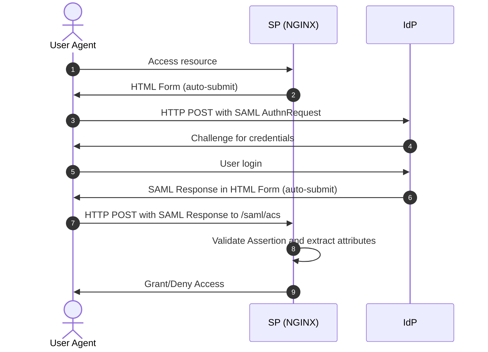

# nginx-saml-sp

Reference implementation of NGINX Plus as service provider for SAML authentication

## Description

This project provides an implementation of SAML Single Sign-On (SSO) for NGINX Plus. It enables NGINX Plus to act as a SAML Service Provider (SP), allowing it to participate in SSO with a SAML Identity Provider (IdP).
This repository describes how to enable SAML Single Sign-On (SSO) integration for [NGINX Plus](https://www.nginx.com/products/nginx/). The solution depends on NGINX Plus component ([key-value store](http://nginx.org/en/docs/http/ngx_http_keyval_module.html)) and as such is not suitable for [open source NGINX](http://www.nginx.org/en) without additional modifications.

This implementation assumes the following environment:

- The identity provider (IdP) supports Security Assertion Markup Language (SAML) [2.0](https://www.oasis-open.org/committees/download.php/27819/sstc-saml-tech-overview-2.0-cd-02.pdf)
- HTTP POST Binding for the IdP-to-SP (Response) message
- NGINX Plus is configured as a SP for a specific IdP
- The IdP knows NGINX Plus as a SP

The communication between the IdP and NGINX Plus is indirect, always taking place through the [User Agent](https://en.wikipedia.org/wiki/User_agent). The flow of the SP-initiated SSO with POST bindings for request and response is shown in the following diagram:


`Figure 1. SAML SP-Initiated SSO with POST Bindings for Request and Response`

NGINX Plus is configured to perform SAML authentication. Upon a first visit to a protected resource, NGINX Plus initiates the SP-initiated flow and redirects the client to the IdP using HTTP-POST binding. When the client returns to NGINX Plus with a SAML Response message, NGINX Plus validates the response, verifies the Response and Assertion signature using the imported public key, extracts preconfigured saml attributes and makes the decision to grant access. NGINX Plus then stores the access token variable and extracted attributes in the key-value store, issues a session cookie to the client using a random string with 160 bits of entropy, (which becomes the key to obtain the access token variable and attributes from the key-value store) and redirects the client to the original URI requested prior to authentication.

Subsequent requests to protected resources are authenticated by exchanging the session cookie for access token variable in the key-value store. It is worth noting that user validation is performed solely on the basis of session cookies and session validity period is enforced by `saml_session_access` keyval zone timeout (default is 1 hour). After the session timeout expires, the user will be redirected to IdP for re-authentication.

### SAML Authentication Request

The SAML authentication request, also known as the SAML AuthnRequest, is a message sent by the SP to the IdP to initiate the SSO process. The NGINX Plus implementation can be configured to use either `HTTP-POST` or `HTTP-Redirect` bindings for the AuthnRequest, depending on the requirements and capabilities of the IdP. The choice of the message delivery method is made through the `$saml_sp_request_binding` variable.
The authentication request also includes the `issuer` parameter, which specifies the entity ID of the SP. This allows the IdP to identify the SP that is initiating the authentication request and to provide the appropriate assertion to the SP. This parameter is controlled by the variable `$saml_sp_entity_id`.
The AuthnRequest may also include other optional parameters such as the `destination`, `nameid policy`, `force_authn`, and others. These parameters can be used to provide additional context for the SSO process and to specify the desired behavior of the IdP during the SSO process. These parameters are controlled through variables `$saml_idp_sso_url`, `$saml_sp_nameid_format` and `$saml_sp_force_authn` respectively.

The AuthnRequest must be signed by the SP to ensure the authenticity and integrity of the request. The signature is created using the private key of the SP, and the public key of the SP is shared with the IdP to verify the signature. The decision to sign the AuthnRequest is made based on the `$saml_idp_sign_authn` variable and can be flexibly configured on per IdP basis. The public and private keys are configured via `$saml_sp_signing_certificate` and `$saml_sp_signing_key` variables.

> **Note:** If you're seeing this message, it means we don't support AuthnRequest signing at this time. If `$saml_idp_sign_authn` is set to true, the corresponding error will be logged.

### SAML Authentication Response

The SAML authentication response is a message sent by the IdP to the SP in response to the SAML AuthnRequest. The SAML Response contains the user’s authentication status and any requested attributes. In the NGINX Plus SAML implementation, the SAML Response is sent to the SP via an HTTP POST request to the SP's Assertion Consumer Service (ACS) endpoint (`/saml/acs` by default). 
Upon receiving the SAML Response, NGINX Plus validates the message and verifies the Response and Assertion signature using the imported public key. The decision to verify the signature is made on the basis of `$saml_sp_want_signed_assertion` variable. The choice of the IdP public key is based on `$saml_idp_verification_certificate` variable. It represents a relative or full path to the certificate file. If you have a X.509 DER certificate, you can exctract public key in the PEM format using the following command:

```shell
$ openssl x509 -inform DER -in saml.crt -pubkey -noout > saml.spki
```

> **Note:** Encrypted Authentication Response, Assertion, NameID or attributes are not currently supported.

## Installation

Start by [installing NGINX Plus](https://docs.nginx.com/nginx/admin-guide/installing-nginx/installing-nginx-plus/). In addition, the [NGINX JavaScript module](https://www.nginx.com/blog/introduction-nginscript/) (njs) is required for handling the interaction between NGINX Plus and the SAML Identity provider (IdP). Install the njs module after installing NGINX Plus by running one of the following:

`$ sudo apt install nginx-plus-module-njs` for Debian/Ubuntu

`$ sudo yum install nginx-plus-module-njs` for CentOS/RHEL

The njs module needs to be loaded by adding the following configuration directive near the top of **nginx.conf**.

```nginx
load_module modules/ngx_http_js_module.so;
```

Finally, create a clone of the GitHub repository.

`$ git clone https://github.com/nginxinc/nginx-saml`

All files can be copied to **/etc/nginx/conf.d**

### Non-standard directories

The GitHub repository contains [`include`](http://nginx.org/en/docs/ngx_core_module.html#include) files for NGINX configuration, and JavaScript code for SAML request generation and processing response. These files are referenced with a relative path (relative to /etc/nginx). If NGINX Plus is running from a non-standard location then copy the files from the GitHub repository to `/path/to/conf/conf.d` and use the `-p` flag to start NGINX with a prefix path that specifies the location where the configuration files are located.

```shell
$ nginx -p /path/to/conf -c /path/to/conf/nginx.conf
```

## Configuring NGINX Plus

Configuration can typically be completed automatically by using SAML Metadata. SAML Metadata is a standard way of exchanging metadata information between SAML entities. It is used by the Service Provider (SP) and Identity Provider (IdP) to communicate configuration information, such as endpoints, signing keys, etc.
> **Note:** SAML Metadata is not currently supported by NGINX Plus.

Manual configuration involves reviewing the following files so that they match your IdP(s) configuration.

- **saml_sp_configuration.conf** - this contains the primary configuration for one or more SPs and IdPs in `map{}` blocks
  - Modify all of the `map…$saml_sp_` blocks to match your SP configuration
  - Modify all of the `map…$saml_idp_` blocks to match your IdP configuration
  - Modify the URI defined in `map…$saml_logout_redirect` to specify an unprotected resource to be displayed after requesting the `/logout` location
  - If NGINX Plus is deployed behind another proxy or load balancer, modify the `map…$redirect_base` and `map…$proto` blocks to define how to obtain the original protocol and port number.

- **frontend.conf** - this is the reverse proxy configuration
  - Modify the upstream group to match your backend site or app
  - Configure the preferred listen port and [enable SSL/TLS configuration](https://docs.nginx.com/nginx/admin-guide/security-controls/terminating-ssl-http/)
  - Modify the severity level of the `error_log` directive to suit the deployment environment

- **openid_connect.server_conf** - this is the NGINX configuration for handling IdP Responses 
  - No changes are usually required here
  - Modify the `client_body_buffer_size` directive to match the maximum size of IdP response (post body)

- **openid_connect.js** - this is the JavaScript code for performing the SAML Authentication
  - No changes are required

### Configuring the Key-Value Store

This is part of the advanced configuration in **saml_sp_configuration.conf**.

The key-value store is used to maintain persistent storage for SAML sessons and extracted SAML attributes. The default configuration should be reviewed so that it suits the environment. If you need access to any extracted SAML attribute as a NGINX variable, you need to create a separate `keyval_zone`, as well as a `keyval` record for each such attribute, for example, if the attribute name is `email` you need to add the following 2 entries:

```nginx
keyval_zone zone=saml_attrib_email:1M    state=saml_attrib_email.json    timeout=1h;
keyval    $cookie_auth_token $email    zone=saml_attrib_email;
```

The following keyval zones are added by default:

```nginx
keyval_zone zone=saml_authn_storage:1M                  state=saml_authn_storage.json                  timeout=5m;
keyval_zone zone=saml_session_access:1M                 state=saml_session_access.json                 timeout=1h;
keyval_zone zone=saml_attrib_uid:1M                     state=saml_attrib_uid.json                     timeout=1h;
keyval_zone zone=saml_attrib_email:1M                   state=saml_attrib_email.json                   timeout=1h;
keyval_zone zone=saml_attrib_eduPersonAffiliation:1M    state=saml_attrib_eduPersonAffiliation.json    timeout=1h;
```

Each of the `keyval_zone` parameters are described below.

- **zone** - Specifies the name of the key-value store and how much memory to allocate for it. Each session will typically occupy less than 1KB, depending on the size of the attributes, so scale this value to exceed the number of unique users that may authenticate.

- **state** (optional) - Specifies where all of the ID Tokens in the key-value store are saved, so that sessions will persist across restart or reboot of the NGINX host. The NGINX Plus user account, typically **nginx**, must have write permission to the directory where the state file is stored. Consider creating a dedicated directory for this purpose.

- **timeout** - Expired tokens are removed from the key-value store after the `timeout` value. Set `timeout` to the desired session duration.

- **sync** (optional) - If deployed in a cluster, the key-value store may be synchronized across all instances in the cluster, so that all instances are able to create and validate authenticated sessions. Each instance must be configured to participate in state sharing with the [zone_sync module](http://nginx.org/en/docs/stream/ngx_stream_zone_sync_module.html) and by adding the `sync` parameter to the `keyval_zone` directives above.