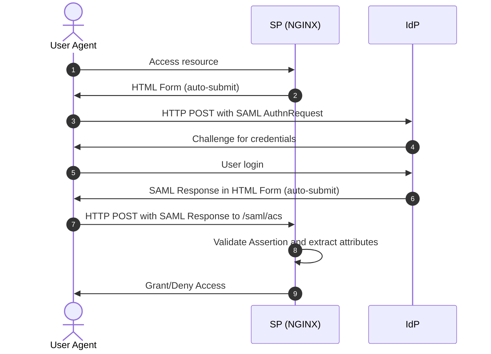
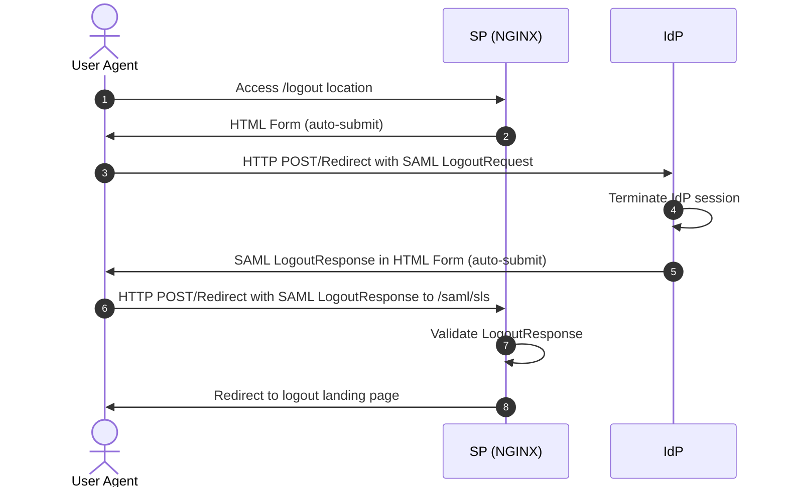

# SAML SSO support for NGINX Plus

Reference implementation of NGINX Plus as service provider for SAML authentication

# Table of contents
- [SAML SSO support for NGINX Plus](#saml-sso-support-for-nginx-plus)
- [Table of contents](#table-of-contents)
- [Description](#description)
- [SAML Authentication Request](#saml-authentication-request)
- [SAML Authentication Response](#saml-authentication-response)
  - [Response](#response)
  - [Issuer](#issuer)
  - [Status](#status)
  - [Assertion](#assertion)
    - [Subject](#subject)
    - [Conditions](#conditions)
    - [Audience](#audience)
    - [AuthnStatement](#authnstatement)
    - [AttributeStatement](#attributestatement)
  - [Response or Assertion Signature](#response-or-assertion-signature)
  - [Encrypted Assertion or NameID elements](#encrypted-assertion-or-nameid-elements)
  - [Redirect user after successful login](#redirect-user-after-successful-login)
- [SAML Single Logout](#saml-single-logout)
  - [SP-Initiated Logout](#sp-initiated-logout)
    - [Sending LogoutRequest](#sending-logoutrequest)
    - [Receiving LogoutResponse](#receiving-logoutresponse)
  - [IdP-Initiated Logout](#idp-initiated-logout)
    - [Receiving LogoutRequest](#receiving-logoutrequest)
    - [Sending LogoutResponse](#sending-logoutresponse)
  - [Disabling Single Logout (SLO)](#disabling-single-logout-slo)
- [Installation](#installation)
  - [Non-standard directories](#non-standard-directories)
- [Configuring NGINX Plus](#configuring-nginx-plus)
  - [Configuring the Key-Value Store](#configuring-the-key-value-store)

# Description

This project provides an implementation of SAML Single Sign-On (SSO) for NGINX Plus. It enables NGINX Plus to act as a SAML Service Provider (SP), allowing it to participate in SSO with a SAML Identity Provider (IdP).
This repository describes how to enable SAML Single Sign-On (SSO) integration for [NGINX Plus](https://www.nginx.com/products/nginx/). The solution depends on NGINX Plus component ([key-value store](http://nginx.org/en/docs/http/ngx_http_keyval_module.html)) and as such is not suitable for [open source NGINX](http://www.nginx.org/en) without additional modifications.

This implementation assumes the following environment:

- The identity provider (IdP) supports Security Assertion Markup Language (SAML) [2.0](https://www.oasis-open.org/committees/download.php/27819/sstc-saml-tech-overview-2.0-cd-02.pdf)
- HTTP POST Binding for the IdP-to-SP (Response) message
- NGINX Plus is configured as a SP for a specific IdP
- The IdP knows NGINX Plus as a SP

The communication between the IdP and NGINX Plus is indirect, always taking place through the [User Agent](https://en.wikipedia.org/wiki/User_agent). The flow of the SP-initiated SSO with POST bindings for request and response is shown in the following diagram:


`Figure 1. SAML SP-Initiated SSO with POST Bindings for AuthnRequest and Response`

NGINX Plus is configured to perform SAML authentication. Upon a first visit to a protected resource, NGINX Plus initiates the SP-initiated flow and redirects the client to the IdP using HTTP-POST binding. When the client returns to NGINX Plus with a SAML Response message, NGINX Plus validates the response, verifies the Response and Assertion signature using the imported public key, extracts preconfigured saml attributes and makes the decision to grant access. NGINX Plus then stores the access token variable and extracted attributes in the key-value store, issues a session cookie to the client using a random string with 160 bits of entropy, (which becomes the key to obtain the access token variable and attributes from the key-value store) and redirects the client to the original URI requested prior to authentication.

Subsequent requests to protected resources are authenticated by exchanging the session cookie for access token variable in the key-value store. It is worth noting that user validation is performed solely on the basis of session cookies and session validity period is enforced by `saml_session_access` keyval zone timeout (default is 1 hour). After the session timeout expires, the user will be redirected to IdP for re-authentication.

# SAML Authentication Request

The SAML authentication request, also known as the SAML AuthnRequest, is a message sent by the SP to the IdP to initiate the SSO process. AuthnRequest could look like the following example:
```xml
<samlp:AuthnRequest xmlns:samlp="urn:oasis:names:tc:SAML:2.0:protocol"
                    AssertionConsumerServiceURL="https://sp.example.com/saml/acs"
                    Destination="http://idp.example.com/saml2/idp/SSOService.php"
                    ID="_8928531bca328da8df006fc73c7433d8aa7e8821"
                    IssueInstant="2023-04-11T05:53:05.567Z"
                    ProtocolBinding="urn:oasis:names:tc:SAML:2.0:bindings:HTTP-POST"
                    Version="2.0"
                    >
    <saml:Issuer xmlns:saml="urn:oasis:names:tc:SAML:2.0:assertion">https://sp.example.com</saml:Issuer>
    <samlp:NameIDPolicy AllowCreate="true"
                        Format="urn:oasis:names:tc:SAML:1.1:nameid-format:emailAddress"
                        />
</samlp:AuthnRequest>
```
The NGINX Plus implementation can be configured to use either `HTTP-POST` or `HTTP-Redirect` bindings for the AuthnRequest, depending on the requirements and capabilities of the IdP. The choice of the message delivery method is made through the `$saml_sp_request_binding` variable.
The authentication request also includes the `issuer` element, which specifies the entity ID of the SP. This allows the IdP to identify the SP that is initiating the authentication request and to provide the appropriate assertion to the SP. This parameter is controlled by the variable `$saml_sp_entity_id`.
The AuthnRequest may also include other optional parameters such as the `destination`, `nameid policy`, `force_authn`, and others. These parameters can be used to provide additional context for the SSO process and to specify the desired behavior of the IdP during the SSO process. These parameters are controlled through variables `$saml_idp_sso_url`, `$saml_sp_nameid_format` and `$saml_sp_force_authn` respectively.

The AuthnRequest must be signed by the SP to ensure the authenticity and integrity of the request. The signature is created using the private key of the SP, and the public key of the SP is shared with the IdP to verify the signature. The decision to sign the AuthnRequest is made based on the `$saml_sp_sign_authn` variable and can be flexibly configured on per IdP basis. The SP private key are configured via `$saml_sp_signing_key` variable.

> **Note:** NGINX currently does not support Detached Signature for the HTTP-Redirect binding. Additionally, the signature algorithm cannot be customized and is always set to rsa-sha256.

# SAML Authentication Response

The SAML authentication response is a message sent by the IdP to the SP in response to the SAML AuthnRequest. The SAML Response contains the user’s authentication status and any requested attributes. In the NGINX Plus SAML implementation, the SAML Response is sent to the SP via an HTTP POST request to the SP's Assertion Consumer Service (ACS) endpoint (`/saml/acs` by default). A response to a successful sign-on attempt looks like the following sample:

```xml
<samlp:Response xmlns:samlp="urn:oasis:names:tc:SAML:2.0:protocol"
                xmlns:saml="urn:oasis:names:tc:SAML:2.0:assertion"
                ID="_fbecfab099b56473aadb467f075ec392ba85369b1c"
                Version="2.0"
                IssueInstant="2023-04-11T05:53:08Z"
                Destination="https://sp.example.com/saml/acs"
                InResponseTo="_8928531bca328da8df006fc73c7433d8aa7e8821"
                >
    <saml:Issuer>https://idp.example.com/saml2/idp</saml:Issuer>
    <ds:Signature xmlns:ds="http://www.w3.org/2000/09/xmldsig#">
        ...
    </ds:Signature>
    <samlp:Status>
        <samlp:StatusCode Value="urn:oasis:names:tc:SAML:2.0:status:Success" />
    </samlp:Status>
    <saml:Assertion xmlns:xsi="http://www.w3.org/2001/XMLSchema-instance"
                    xmlns:xs="http://www.w3.org/2001/XMLSchema"
                    ID="_25c7a78c5991c7c4039591fa4deca0000f1a9992ec"
                    Version="2.0"
                    IssueInstant="2023-04-11T05:53:08Z"
                    >
        <saml:Issuer>https://idp.example.com/saml2/idp</saml:Issuer>
        <saml:Subject>
            <saml:NameID SPNameQualifier="https://sp.example.com"
                         Format="urn:oasis:names:tc:SAML:1.1:nameid-format:unspecified"
                         >user1@example.com</saml:NameID>
            <saml:SubjectConfirmation Method="urn:oasis:names:tc:SAML:2.0:cm:bearer">
                <saml:SubjectConfirmationData NotOnOrAfter="2023-04-11T05:58:07Z"
                                              Recipient="https://sp.example.com/saml/acs"
                                              InResponseTo="_8928531bca328da8df006fc73c7433d8aa7e8821"
                                              />
            </saml:SubjectConfirmation>
        </saml:Subject>
        <saml:Conditions NotBefore="2023-04-11T05:52:37Z"
                         NotOnOrAfter="2023-04-11T05:58:07Z"
                         >
            <saml:AudienceRestriction>
                <saml:Audience>https://sp.example.com</saml:Audience>
            </saml:AudienceRestriction>
        </saml:Conditions>
        <saml:AuthnStatement AuthnInstant="2023-04-11T05:53:08Z"
                             SessionNotOnOrAfter="2023-04-11T13:53:07Z"
                             SessionIndex="_cb7cde8b390ad8952e7ae00287e88a25334465fa85"
                             >
            <saml:AuthnContext>
                <saml:AuthnContextClassRef>urn:oasis:names:tc:SAML:2.0:ac:classes:Password</saml:AuthnContextClassRef>
            </saml:AuthnContext>
        </saml:AuthnStatement>
        <saml:AttributeStatement>
            <saml:Attribute Name="uid"
                            NameFormat="urn:oasis:names:tc:SAML:2.0:attrname-format:basic"
                            >
                <saml:AttributeValue xsi:type="xs:string">1</saml:AttributeValue>
            </saml:Attribute>
            <saml:Attribute Name="memberOf"
                            NameFormat="urn:oasis:names:tc:SAML:2.0:attrname-format:basic"
                            >
                <saml:AttributeValue xsi:type="xs:string">group1, admins, students</saml:AttributeValue>
            </saml:Attribute>
            <saml:Attribute Name="email"
                            NameFormat="urn:oasis:names:tc:SAML:2.0:attrname-format:basic"
                            >
                <saml:AttributeValue xsi:type="xs:string">user1@example.com</saml:AttributeValue>
            </saml:Attribute>
        </saml:AttributeStatement>
    </saml:Assertion>
</samlp:Response>
```

Upon receiving the SAML response, NGINX Plus performs a series of validations and checks to ensure a secure and compliant SSO implementation.

## Response
The Response element includes the result of the authorization request. NGINX Plus checks the "ID" to ensure it has not been reused, providing protection against replay attacks, "Version" and "IssueInstant" values in the Response element. It also verifies the following attributes (only if they are present):

- `Destination`: must match the Assertion Consumer Service (ACS) URL of the Service Provider, which is determined by the `$saml_sp_acs_url` variable.
- `InResponseTo`: must match the `ID` attribute of the AuthnRequest element that initiated the response.

## Issuer
NGINX Plus verifies the `Issuer` element, which must match the IdP EntityID defined by the `$saml_idp_entity_id` variable.

## Status
The `Status` element conveys the success or failure of the SSO. It can include the `StatusCode` element, which contains a code or a set of nested codes that represents the status of the request and the `StatusMessage` element, which contains custom error messages that are generated during the sign-on process by IdP. If the status does not match `urn:oasis:names:tc:SAML:2.0:status:Success`, access to the protected resource is denied.

## Assertion
The Assertion is validated using the same approach as the Response, with the exception that we do not check the `ID` for replay attacks. Therefore, we recommend always signing the entire Response to ensure security.

### Subject
The `Subject` element specifies the principle that is the subject of the statements in the assertion. It must contain a `NameID` element, which represents the authenticated user. The `NameID` is a unique identifier for the user within the context of the Identity Provider, while the `NameID Format` describes the format or namespace of the `NameID`. When processing the Subject, NGINX Plus parses both the NameID and the NameID Format, which are then stored in the `$saml_name_id` and `$saml_name_id_format` variables, respectively.

### Conditions
The `Conditions` element defines the conditions under which the SAML Assertion is considered valid. It is a mandatory element, and an assertion without it will be deemed invalid. NGINX Plus checks the values of the `NotBefore` and `NotOnOrAfter` attributes to ensure the assertion is being used within the specified time window.

NGINX Plus accommodates potential clock discrepancies between the Service Provider and the Identity Provider with the `$saml_allowed_clock_skew` variable. This variable defines an acceptable range of time skew in seconds, allowing NGINX Plus to adjust the validation window for slight time differences between systems.
If `$saml_allowed_clock_skew` is not defined, NGINX Plus applies a default value of `120` seconds.

### Audience
If the `AudienceRestriction` element is present, it restricts the assertion's applicability to specific intended audiences, or Service Providers, to which it may be sent. NGINX Plus verifies that the Service Provider's Entity ID, specified by the `$saml_sp_entity_id` variable, is listed as an acceptable audience for the assertion. This step ensures that the assertion is intended for the correct Service Provider and prevents unauthorized access to resources.

### AuthnStatement
The `AuthnStatement` element asserts that the subject of the assertion has been authenticated using specific means at a particular time. If it contains a `SessionIndex` attribute, the value will be stored in the `$saml_session_index` variable.

The `AuthnInstant` attribute indicates the time at which the user was authenticated by the Identity Provider and must be present. 

The `AuthnContext` element specifies the authentication context used for authenticating the user. The value of the `authnContextClassRef` element is stored in the `$saml_authn_context_class_ref` variable. This information can be useful for understanding the level of assurance provided by the authentication method and for making access control decisions based on that level of assurance.

### AttributeStatement
The `AttributeStatement` element contains assertions about the subject or user. During the processing, we currently store only the `AttributeValue` in key-value variables. You must manually pre-create the key-value zone and variable for each attribute name (see examples in the `saml_sp_configuration.conf` file). This allows you to store and access user attributes provided by the Identity Provider for use in access control decisions, personalization, or other custom functionality within your application.

## Response or Assertion Signature

The Identity Provider can choose to sign either the entire SAML Response or just the Assertion within the response upon successful authentication. The Signature element contains a digital signature that NGINX Plus can use to authenticate the source and verify the integrity of the assertion. The decision to validate the signature is based on the variables `$saml_sp_want_signed_response` and `$saml_sp_want_signed_assertion`.

The selection of the IdP's public key is determined by the variable `$saml_idp_verification_certificate`. This variable represents the relative or absolute path to the certificate file in SPKI format. This file may contain one or more public keys, separated by "-----BEGIN PUBLIC KEY----- / -----END PUBLIC KEY-----" markers, which will be used sequentially for signature verification. This approach is necessary for handling the rotation of public keys.

If you have a publc key in PEM format, you can use the following command to convert certificate to DER format and extract public key from DER certificate:

```shell
$ openssl x509 -in saml_idp_verify.pem -text -noout # view/check PEM (Privacy-Enhanced Mail) encoded certificate
$ openssl x509 -in saml_idp_verify.pem -outform DER -out saml_idp_verify.der  # convert PEM to DER format
$ openssl x509 -inform DER -in saml_idp_verify.der -pubkey -noout > saml_idp_verify.spki # extract public key from DER certificate
$ openssl rsa -pubin -in saml_idp_verify.spki -text # view/check a public key in PKCS#1 format
```

The following signature algorithms are supported:
- http://www.w3.org/2001/04/xmldsig-more#rsa-sha256
- http://www.w3.org/2000/09/xmldsig#rsa-sha1
 
The following digest algorithms are supported:
- http://www.w3.org/2000/09/xmldsig#sha1
- http://www.w3.org/2001/04/xmlenc#sha256

## Encrypted Assertion or NameID elements

A SAML Response may contain `EncryptedAssertion` and `EncryptedID` elements, which represent encrypted `Assertion` and `NameID` elements, respectively. NGINX Plus can decrypt these elements if they are present in the response. To specify the private key in PEM format to be used for decryption, use the variable `$saml_sp_decryption_key`. This variable represents the relative or absolute path to the key file.

The following key encryption algorithms are supported:
- http://www.w3.org/2001/04/xmlenc#rsa-oaep-mgf1p
- http://www.w3.org/2009/xmlenc11#rsa-oaep
- http://www.w3.org/2001/04/xmlenc#rsa-1_5
 
The following data encryption algorithms are supported:
- http://www.w3.org/2001/04/xmlenc#aes128-cbc
- http://www.w3.org/2001/04/xmlenc#aes192-cbc
- http://www.w3.org/2001/04/xmlenc#aes256-cbc
- http://www.w3.org/2009/xmlenc11#aes128-gcm
- http://www.w3.org/2009/xmlenc11#aes192-gcm
- http://www.w3.org/2009/xmlenc11#aes256-gcm

## Redirect user after successful login

After receiving a SAML Response with a successful status, the user is redirected by default to the address preceding the authentication request. If you want to change this behavior and redirect the user to a different address, you can use the configuration variable `$saml_sp_relay_state`. This can be either an absolute or relative URL.

It's important to note that this will only work for SP-initiated Single Sign-On (SSO). For IdP-initiated SSO, the `RelayState` is provided by the IdP, and the user will be redirected to the address specified in the RelayState if it is present. If the RelayState is not provided, the user will be redirected to the application's root.

# SAML Single Logout
SAML Single Logout (SLO) is a feature that allows users to log out from all service providers (SPs) and identity providers (IdPs) involved in an SSO session with a single action. NGINX Plus supports both sending and processing LogoutRequest and LogoutResponse messages for both SP-initiated and IdP-initiated logout scenarios.


`Figure 2. SAML SP-Initiated SLO with POST/Redirect Bindings for LogoutRequest and LogoutResponse`

We support both Redirect (HTTP GET) and HTTP POST bindings for sending and receiving SLO messages. Redirect binding uses HTTP GET requests to transmit SAML messages via URL query parameters, while HTTP POST binding utilizes HTTP POST requests to send SAML messages within the body of an HTML form. The choice of binding method for SLO messages can be configured using the `$saml_sp_slo_binding` configuration variable, which allows you to select either 'HTTP-POST' or 'HTTP-Redirect' methods as required for your IdP.

By default, as the endpoint where NGINX Plus processes all SLO-related messages, we use the `/saml/sls` location, which can be modified in the `saml_sp.server_conf` file. At the same time, do not forget to update the `$saml_sp_slo_url` variable, which reflects the full URL, including the scheme (http or https) and domain name, corresponding to your service provider.

## SP-Initiated Logout
In the SP-initiated logout process, NGINX Plus initiates the logout by sending a LogoutRequest message to the identity provider (IdP). Upon receiving the LogoutRequest, the IdP is responsible for terminating the user's session and then sending a LogoutResponse message back to NGINX Plus, confirming the successful completion of the logout process. 

### Sending LogoutRequest
When NGINX Plus creates and sends the LogoutRequest message, the destination for the request is determined by the `$saml_idp_slo_url` variable. This variable specifies the endpoint at the IdP to which the LogoutRequest should be sent. The following snippet shows an example of a LogoutRequest element:

```xml
<samlp:LogoutRequest xmlns:samlp="urn:oasis:names:tc:SAML:2.0:protocol"
                     Destination="https://idp.example.com/saml2/idp"
                     ID="_e5f8787140d99f8eed9ef897ef4664ef773b1f41"
                     IssueInstant="2023-04-11T05:52:58.644Z"
                     Version="2.0"
                     >
    <saml:Issuer xmlns:saml="urn:oasis:names:tc:SAML:2.0:assertion">https://sp.example.com</saml:Issuer>
    <ds:Signature xmlns:ds="http://www.w3.org/2000/09/xmldsig#">
        ...
    </ds:Signature>
    <saml:NameID xmlns:saml="urn:oasis:names:tc:SAML:2.0:assertion">user1@example.com</saml:NameID>
</samlp:LogoutRequest>
```

The decision whether to sign the LogoutRequest message is made based on the value of the `$saml_sp_sign_slo` variable. If the variable is set to "true", NGINX Plus will sign the LogoutRequest message to ensure its authenticity and integrity. The signature is created using the private key of the SP.

It is important to note that NGINX Plus does not use the `sessionindex` attribute when sending LogoutRequest messages. Instead, we rely on the `NameID` attribute to associate user sessions with the corresponding subject. This means that when NGINX Plus sends a LogoutRequest, only the `NameID` parameter is included in the message, allowing the IdP to identify the user session to be terminated.

### Receiving LogoutResponse
After sending a LogoutRequest message to the IdP, NGINX Plus waits for the IdP to send a LogoutResponse message back. This message indicates the status of the logout process initiated by the service provider (SP). The following snippet shows an example of a LogoutResponse element:

```xml
<samlp:LogoutResponse xmlns:samlp="urn:oasis:names:tc:SAML:2.0:protocol"
                      xmlns:saml="urn:oasis:names:tc:SAML:2.0:assertion"
                      ID="_4c5386f715744160380c7f9f0e95d3327e3e10a81e"
                      Version="2.0"
                      IssueInstant="2023-04-11T05:52:58Z"
                      Destination="https://sp.example.com/saml/sls"
                      InResponseTo="_e5f8787140d99f8eed9ef897ef4664ef773b1f41"
                      >
    <saml:Issuer>https://idp.example.com/saml2/idp</saml:Issuer>
    <samlp:Status>
        <samlp:StatusCode Value="urn:oasis:names:tc:SAML:2.0:status:Success" />
    </samlp:Status>
</samlp:LogoutResponse>
```

The user session will be terminated only if the IdP sends a successful LogoutResponse.

The decision whether to require a signature for the LogoutResponse message is determined by the `$saml_sp_want_signed_slo` variable. If the variable is set to "true," NGINX Plus expects the LogoutResponse from the IdP to be digitally signed. This helps ensure the authenticity and integrity of the message.

Upon successful logout, the user is redirected to the URL specified by the `$saml_logout_landing_page` variable. This is typically a non-authenticated page that says goodbye to the user and does not require any further authentication.

## IdP-Initiated Logout
In the IdP-initiated logout process, the IdP initiates the logout by sending a LogoutRequest message to NGINX Plus. Upon receiving the LogoutRequest, NGINX Plus is responsible for terminating the user's session and then sending a LogoutResponse message back to the IdP, confirming the successful completion of the logout process.

### Receiving LogoutRequest
In the IdP-initiated logout process, NGINX Plus receives a LogoutRequest message from the IdP without prior SP-initiated communication. The LogoutRequest message serves to initiate the logout process for the user session.

The decision whether to require a signed LogoutRequest is determined by the `$saml_sp_want_signed_slo` variable. If set to "true," NGINX Plus expects the LogoutRequest from the IdP to be digitally signed, ensuring the authenticity and integrity of the message.

NGINX Plus does not use `sessionindex` when receiving LogoutRequest messages. Instead, it relies on the `NameID` to link user sessions to the corresponding identity. When a LogoutRequest message is received, NGINX Plus checks whether the `NameID` received in the message matches the one stored in the session variable `$saml_name_id`. If the received `NameID` does not match, the LogoutResponse Status will be `urn:oasis:names:tc:SAML:2.0:status:Requester`.

However, it is important to note that if NGINX Plus receives a LogoutRequest message for a non-existent session, it will still return a success status, as this complies with the SAML standard.

### Sending LogoutResponse
In the IdP-initiated logout process, after receiving and processing the LogoutRequest message from the identity provider (IdP), NGINX Plus sends a LogoutResponse message back to the IdP. This message serves to confirm the successful logout of the user session and inform the IdP about the outcome of the logout process.

The decision whether to sign the LogoutResponse message is determined by the `$saml_sp_sign_slo` variable. If set to "true," NGINX Plus will digitally sign the LogoutResponse message before sending it to the IdP, ensuring the authenticity and integrity of the message.

## Disabling Single Logout (SLO)
There might be cases where you need to disable SLO, for example, if your IdP doesn't support it, or if you don't want SLO to initiate the logout process for all SPs that currently have active sessions with the IdP.

To disable SLO, set the configuration variable `$saml_idp_slo_url` to an empty value. By doing so, you can still initiate the session termination process by sending a request to the `/logout` location. The user session will be cleared, and the user will be redirected to the `$saml_logout_landing_page` URL.

It's important to note that disabling SLO does not terminate the IdP session. If the user tries to access the application after logging out, they will be redirected to the SP with a valid SAML Response without re-authentication. If you want to enforce re-authentication, you can change this behavior by setting the "force_authn = true" parameter in the AuthnRequest. For more information, refer to the description of the `$saml_sp_force_authn` variable in the `saml_sp_configuration.conf` file.

# Installation

Start by [installing NGINX Plus](https://docs.nginx.com/nginx/admin-guide/installing-nginx/installing-nginx-plus/). In addition, the [NGINX JavaScript module](https://www.nginx.com/blog/introduction-nginscript/) (njs) is required for handling the interaction between NGINX Plus and the SAML Identity provider (IdP). Install the njs module after installing NGINX Plus by running one of the following:

`$ sudo apt install nginx-plus-module-njs` for Debian/Ubuntu

`$ sudo yum install nginx-plus-module-njs` for CentOS/RHEL

The njs module needs to be loaded by adding the following configuration directive near the top of **nginx.conf**.

```nginx
load_module modules/ngx_http_js_module.so;
```

Finally, create a clone of the GitHub repository.

`$ git clone https://github.com/nginxinc/nginx-saml`

All files can be copied to **/etc/nginx/conf.d**

## Non-standard directories

The GitHub repository contains [`include`](http://nginx.org/en/docs/ngx_core_module.html#include) files for NGINX configuration, and JavaScript code for SAML request generation and processing response. These files are referenced with a relative path (relative to /etc/nginx). If NGINX Plus is running from a non-standard location then copy the files from the GitHub repository to `/path/to/conf/conf.d` and use the `-p` flag to start NGINX with a prefix path that specifies the location where the configuration files are located.

```shell
$ nginx -p /path/to/conf -c /path/to/conf/nginx.conf
```

# Configuring NGINX Plus

Configuration can typically be completed automatically by using SAML Metadata. SAML Metadata is a standard way of exchanging metadata information between SAML entities. It is used by the Service Provider (SP) and Identity Provider (IdP) to communicate configuration information, such as endpoints, signing keys, etc.
> **Note:** SAML Metadata is not currently supported by NGINX Plus.

Manual configuration involves reviewing the following files so that they match your IdP(s) configuration.

- **saml_sp_configuration.conf** - this contains the primary configuration for one or more SPs and IdPs in `map{}` blocks
  - Modify all of the `map…$saml_sp_` blocks to match your SP configuration
  - Modify all of the `map…$saml_idp_` blocks to match your IdP configuration
  	- You may also add another block `map $host $saml_idp_slo_response_url` in case your IdP has different endpoints for SingleLogoutRequest and SingleLogoutResponse. Leaving this empty select the same endpoint for both assertions.
  - Modify the URI defined in `map…$saml_logout_redirect` to specify an unprotected resource to be displayed after requesting the `/logout` location
  - If NGINX Plus is deployed behind another proxy or load balancer, modify the `map…$redirect_base` and `map…$proto` blocks to define how to obtain the original protocol and port number.
  - If you need to adjust the default allowable clock skew from the standard 120 seconds to accommodate time differences between the SP and IdP, add the `map…$saml_sp_clock_skew` block and specify the desired value in seconds.

- **frontend.conf** - this is the reverse proxy configuration
  - Modify the upstream group to match your backend site or app
  - Configure the preferred listen port and [enable SSL/TLS configuration](https://docs.nginx.com/nginx/admin-guide/security-controls/terminating-ssl-http/)
  - Modify the severity level of the `error_log` directive to suit the deployment environment

- **saml_sp.server_conf** - this is the NGINX configuration for handling IdP Responses 
  - No changes are usually required here
  - Modify the `client_body_buffer_size` directive to match the maximum size of IdP response (post body)

- **saml_sp.js** - this is the JavaScript code for performing the SAML Authentication
  - No changes are required

## Configuring the Key-Value Store

This is part of the advanced configuration in **saml_sp_configuration.conf**.

The [key-value store](http://nginx.org/en/docs/http/ngx_http_keyval_module.html) is used to maintain persistent storage for SAML sessons and extracted SAML attributes. The default configuration should be reviewed so that it suits the environment. If you need access to any extracted SAML attribute as a NGINX variable, you need to create a separate `keyval_zone`, as well as a `keyval` record for each such attribute, for example, if the SAML attribute name is `email` you need to add the following 2 entries:

```nginx
keyval_zone    zone=saml_attrib_email:1M                state=/var/lib/nginx/state/saml_attrib_email.json   timeout=1h;
keyval         $cookie_auth_token $saml_attrib_email    zone=saml_attrib_email;
```

> **Note**:
> - The NGINX variable name includes the prefix `$saml_attrib_`. In the example above, the full variable name would be `$saml_attrib_email`.  
> - If a SAML attribute name is a namespace-qualified (like "http://schemas.example.com/identity/claims/displayname"), the system will use the last segment after the final slash ("/") as the attribute name. So, in this case, `displayname` will be correctly saved. Review your configuration if you use URI-style SAML attributes.

The following keyval zones are added by default:

```nginx
# Zone for storing AuthnRequest and LogoutRequest message identifiers (ID)
# to prevent replay attacks. (REQUIRED)
# Timeout determines how long the SP waits for a response from the IDP,
# i.e. how long the user authentication process can take.
keyval_zone zone=saml_request_id:1M                 state=/var/lib/nginx/state/saml_request_id.json                  timeout=5m;

# Zone for storing SAML Response message identifiers (ID) to prevent replay attacks. (REQUIRED)
# Timeout determines how long the SP keeps IDs to prevent reuse.
keyval_zone zone=saml_response_id:1M                state=/var/lib/nginx/state/saml_response_id.json                 timeout=1h;

# Zone for storing SAML session access information. (REQUIRED)
# Timeout determines how long the SP keeps session access decision (the session lifetime).
keyval_zone zone=saml_session_access:1M             state=/var/lib/nginx/state/saml_session_access.json              timeout=1h;

# Zone for storing SAML NameID values. (REQUIRED)
# Timeout determines how long the SP keeps NameID values. Must be equal to session lifetime.
keyval_zone zone=saml_name_id:1M                    state=/var/lib/nginx/state/saml_name_id.json                     timeout=1h;

# Zone for storing SAML NameID format values. (REQUIRED)
# Timeout determines how long the SP keeps NameID format values. Must be equal to session lifetime.
keyval_zone zone=saml_name_id_format:1M             state=/var/lib/nginx/state/saml_name_id_format.json              timeout=1h;

# Zone for storing SAML SessionIndex values. (REQUIRED)
# Timeout determines how long the SP keeps SessionIndex values. Must be equal to session lifetime.
keyval_zone zone=saml_session_index:1M              state=/var/lib/nginx/state/saml_session_index.json               timeout=1h;

# Zone for storing SAML AuthnContextClassRef values. (REQUIRED)
# Timeout determines how long the SP keeps AuthnContextClassRef values. Must be equal to session lifetime.
keyval_zone zone=saml_authn_context_class_ref:1M    state=/var/lib/nginx/state/saml_authn_context_class_ref.json     timeout=1h;
```

Each of the `keyval_zone` parameters are described below.

- **zone** - Defines the name of the key-value store and the amount of memory allocated for it. Each session typically occupies less than 1KB, depending on the attribute size. To accommodate unique users who may authenticate, scale this value accordingly.

- **state** (optional) - Specifies the location where all of the SAML-related attributes in the key-value store are saved, ensuring that sessions persist across restarts or reboots of the NGINX host. The NGINX Plus user account, typically **nginx**, must have write permission to the directory where the state file is stored. It is recommended to create a dedicated directory for this purpose.

- **timeout** - Expired attributes are removed from the key-value store after the specified `timeout` value. Set `timeout` to the desired session duration to control attribute persistence.

- **sync** (optional) - When deployed in a cluster, the key-value store can be synchronized across all instances in the cluster, enabling all instances to create and validate authenticated sessions. To configure each instance for state sharing, use the [zone_sync module](http://nginx.org/en/docs/stream/ngx_stream_zone_sync_module.html) and add the `sync` parameter to the `keyval_zone` directives mentioned earlier.
